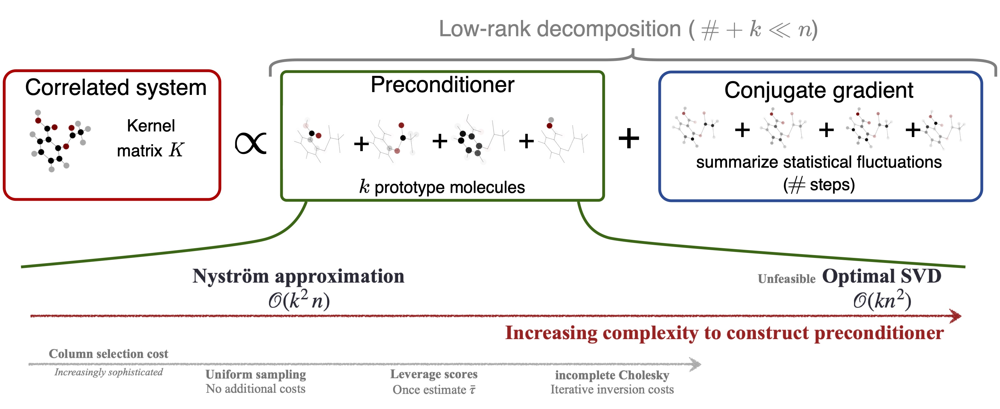

# Reconstructing Kernel-Based Machine Learning Force Fields with Superlinear Convergence
This repository accompanies our [paper](https://doi.org/10.1021/acs.jctc.2c01304). If you build on our research please cite as follows
```
@article{bluecher2023reconstructing,
  title={Reconstructing Kernel-Based Machine Learning Force Fields with Superlinear Convergence},
  author={Blücher, Stefan and Müller, Klaus-Robert and Chmiela, Stefan},
  journal={Journal of Chemical Theory and Computation},
  publisher={ACS Publications},
  year={2023},
  volume={19},
  number={14},
  pages={4619–4630},
  doi={10.1021/acs.jctc.2c01304},
}
```
In particular, this repository provides access to a wide-range of possible preconditioners, which are applicable to correlated systems.


## Installation
```
conda create --name cholesky python=3.7 numpy scipy matplotlib tqdm scikit-learn jupyter
conda activate cholesky
conda install pytorch torchvision cudatoolkit=10.1 -c pytorch
cd project/sGDML
pip install -e . 
sgdml-get dataset aspirin_dft
sgdml-get dataset ethanol_dft
```


## Experiments
You can start new experiments by executing `cluster_main.py`. Per default the script will load the nanotube dataset.
To load a different dataset first download the corresponding file via `sgdml-get dataset ethanol_dft` into the `data/` 
folder and then change argparser accordingly. 